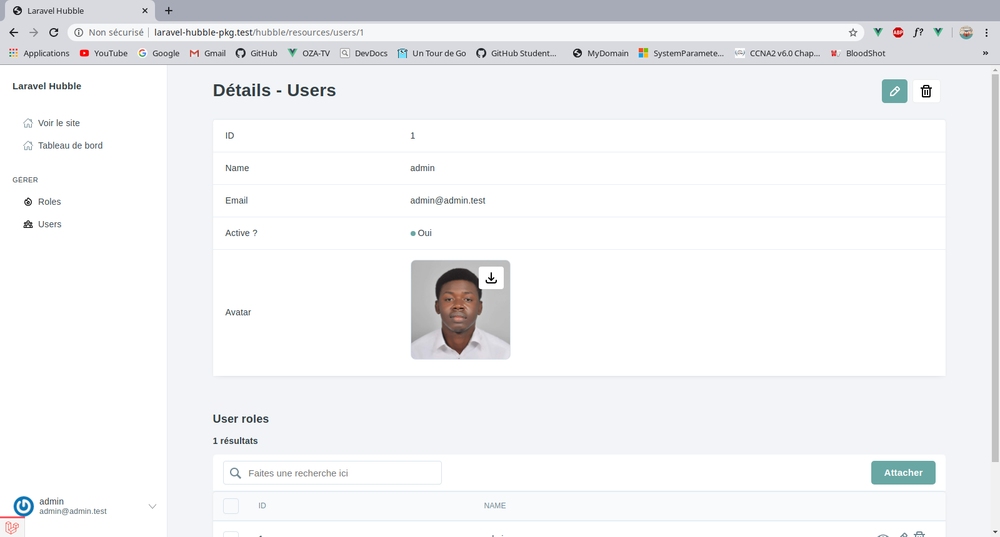

# Laravel Hubble

[](https://packagist.org/packages/oza75/laravel-hubble)
[](https://travis-ci.org/oza75/laravel-hubble)
[](https://scrutinizer-ci.com/g/oza75/laravel-hubble)
[](https://packagist.org/packages/oza75/laravel-hubble)

Build a beautiful dashboard with laravel in no time.



## Requirements
- php : ^7.1
- Laravel : ^6.0

## Installation
You can install the package via composer:

```bash
composer require oza75/laravel-hubble
```
Then install laravel-hubble
```bash
php artisan hubble:install
```
Now go to : http://yourapp.tld/hubble (or http://localhost:8000/hubble if you use `artisan serve`)

## Authentification
Hubble uses the default Laravel authorization gate to check if a user can access to the dashboard. 
By default, everyone can access to hubble dashboard. You are free to modify this gate in your `App\Providers\AppServiceProvider` boot method to restrict access.

```php 
 Gate::define('viewHubble', function (User $user) {
      return $user->isAdmin();
 });
```

## Usage

### Resources

A hubble resource is a simple php class which aims to represent the resource you want to add, namely the different fields, actions, filters, etc. that it has.

#### Create resource 
You can create a new resource by running `hubble:resource` command
``` php
php artisan hubble:resource UserResource
```
This will automatically create a new resource under `app/Hubble` folder

```php 
<?php

namespace App\Hubble;

use Illuminate\Database\Eloquent\Builder;
use Oza75\LaravelHubble\Action;
use Oza75\LaravelHubble\Field;
use Oza75\LaravelHubble\Filter;
use Oza75\LaravelHubble\Actions\DeleteAction;

use App\Hubble\Resource;

class UserResource extends Resource
{

    /**
     * @var string The title will be used as your resource name in the ui
     */
    protected $title = "Users";

    /**
     * @var string[]
     */
    protected $searchColumns = ['id'];

    /**
     * @var string used to show resource value in relationship
     */
    protected $displayColumn = 'id';

    /**
     * Get the fields displayed that the user resource
     *
     * @return Field[] array of fields
     */
    public function fields()
    {
        return [
            Field::make('id', 'ID'),
            Field::make('name', 'Name')
        ];
    }

    /**
     * Register all actions that the user resource have
     *
     * @return Action[] array of actions
     */
    public function actions()
    {
        return [
            DeleteAction::make(\App\User::query()),

        ];
    }

    /**
     * Register all filters that the user resource have
     *
     * @return Filter[] array of filters
     */
    public function filters()
    {
        return [];
    }

    /**
     * @return Builder
     */
    public function baseQuery(): Builder
    {
        return \App\User::query();
    }

    /**
     * Return this resource icon
     *
     * @return string|null
     */
    public function icon()
    {
        return null;
    }
}
```
After your resource is generated, you need to set the `eloquent builder` hubble should use to get your data. When generating this resource we will try to obtain the eloquent builder according to the name of the resource passed in `php artisan hubble:resource` command.
You can modify this query builder to add some computed fields.
```php 
    /**
     * @return Builder
     */
    public function baseQuery(): Builder
    {
        return \App\User::query()->select('*')->selectRaw('age > 18 as is_adult');
    }
```

`fields` method is used to return all fields your want to display. By default, hubble comes with some fields like `TextField`, `TextareaField`, `ImageField` and more. But you can also create your own custom field.  
```php
    /**
     * Get the fields displayed that the user resource
     *
     * @return Field[] array of fields
     */
    public function fields()
    {
        return [
            Field::make('id', 'ID'),

            TextField::make('name', 'Name')->sortable(),

            TextareaField::make('bio', 'Bio')->onlyOnDetails(),

            TextField::make('email', 'Email')->displayOnIndexUsing(function ($value) {
                return "<a href='mailto:$value'>$value</a>";
            })->type('email')->sortable(),
        ];
    }
```
#### Registering your resource
By default, hubble will automatically register all resources you have under `app/Hubble` folder.

Just go to `http://yourapp.tld/hubble` and you will see the new user resource that we add.

You can customize the folder within hubble must look for your resources in config file. The auto registration is very useful when developing your dashboard
but you may disable it in production to gain a small performance.

In your AppServiceProvider :
```php
    /**
     * Bootstrap any application services.
     *
     * @return void
     */
    public function boot()
    {
       \Oza75\LaravelHubble\Facades\Hubble::disableAutoDiscovering(); // will disable auto registration of your resources.
        
        \Oza75\LaravelHubble\Facades\Hubble::addResources([
            UserResource::class,
            PostResource::class,
        ]); // to add manually your resources
    }
```  

### Actions

Action is used to perform custom tasks on one or more Eloquent models. You can generate action using :
```bash
php artisan hubble:action ActiveUsers
```
This command will generate a new `ActiveUsers` class under `app/Hubble/Actions`
```php
<?php

namespace App\Hubble\Actions;

use Oza75\LaravelHubble\Action;

class ActiveUsers extends Action
{
    /**
     * @var string the title of this action
     */
    protected $title = 'ActiveUsers';

    /**
     * @var string the confirmation message to warn user before running this action. Set to null to disable it
     */
    protected $confirmationMessage = 'Do you really want to perform this action ?';

    /**
     * Handle your action
     *
     * @param $ids
     * @return void
     */
    public function handle($ids)
    {
        // TODO: Implement handle() method.
    }
}
```
The `title` property contains the name of the action that will be shown on the User Interface

In the `handle` method you can perform your action. For our example, let's assume that our users table has an active column which determine whether the user is active or not. 
```php
    /**
     * Handle your action
     *
     * @param $ids
     * @return void
     */
    public function handle($ids)
    {
        User::query()->whereIn('id', $ids)->update(['active' => true]);
    }
```
When you created your action you can add it in your resource.
```php 
    /**
     * Register all actions that the user resource have
     *
     * @return Action[] array of actions
     */
    public function actions()
    {
        return [
            DeleteAction::make(\App\User::query()),
            new ActiveUsers(),

        ];
    }
```

### Filters
As the name suggests, filters are used to filter your data and display only data that satisfy certain conditions.
There are many ways to add filter into your resource : 

- the first way (the easiest way ) :

```php
    /**
     * Register all filters that the user resource have
     *
     * @return Filter[] array of filters
     */
    public function filters()
    {
        return [
            Filter::make('is_active', 'Only Active Users', ['Yes' => 1, 'No' => 0]),
        ];
    }
```
`Filter::make` take as is first argument, the column in the database. The second argument is the title and then the third array of options.
 
The options' argument is an associative array where the key is the label and the value, the value of the option. You can also pass an url where the options
 should be fetched or a custom array. for those cases you may set the valueKey and the textKey
 using the `setValueKey(string $key)`, and the `setTextKey(string $key)`. 
 
 For example:
 ```php
    /**
     * Register all filters that the user resource have
     *
     * @return Filter[] array of filters
     */
    public function filters()
    {
        return [
            Filter::make('is_active', 'Users Status', [ 
                ['name' => 'All', 'value' => null], 
                ['name' => 'Active', 'value' => 1], 
                ['name' => 'Non active', 'value' => 0]
            ])->setValueKey('value')->setTextKey('name'),
        ];
    }
```
Another example:
```php
    /**
     * Register all filters that the user resource have
     *
     * @return Filter[] array of filters
     */
    public function filters()
    {
        return [
            Filter::make('state', 'Users State', "https://restcountries.eu/rest/v2/all")
                ->setValueKey('alpha3Code')
                ->setTextKey('name')
                ->searchable('Start typing a state...'),
        ];
    }
```
- the second way to define a filter (more powerful) :

```php
    /**
     * Register all filters that the user resource have
     *
     * @return Filter[] array of filters
     */
    public function filters()
    {
        return [
            Filter::make('state', 'Users State', "https://restcountries.eu/rest/v2/all")
                ->setValueKey('alpha3Code')
                ->setTextKey('name')
                ->setHandler(function (Builder $builder, $value) {
                    $builder->whereHas('state', function ($query) use ($value) {
                        $query->where('code', $value);
                    });
                }),
        ];
    }
```
With this way, you can use the `setHandler` method to pass a callable that takes the `query builder` as his first argument and the value of the filter, you can add any `where clause` you want. 

- The last way is to generate a new filter class.
```bash
php artisan hubble:filter MyCustomFilter
```
This command will generate a new filter class under `app/Hubble/Filters`.
```php
<?php

namespace App\Hubble\Filters;

use Illuminate\Database\Eloquent\Builder;
use Oza75\LaravelHubble\Filter;

class MyCustomFilter extends Filter
{
    /**
     * @var string the title of your filter that will be shown on the ui.
     */
    protected $title = 'My custom filter';

    /**
     * @var string the VueJs component that will be used to display this filter
     */
    protected $component = 'hubble-checkbox-filter';

    /**
     * Apply your filter
     *
     * @param Builder $query
     * @param $value
     * @return void
     */
    public function handle(Builder $query, $value)
    {
        // apply your filter here. 
        return null;
    }

    /**
     * Return all options for this filter
     *
     * @return array
     */
    public function options()
    {
        // first way
        return ['Option 1' => 1, 'Option 2' => 2]; // the key is the label and the value is the option value
        // second way
        return [
                    ['name' => 'Option 1', 'value' => 1],
                    ['name' => 'Option 2', 'value' => 2],
               ]; 
        // third way
        return "https://restcountries.eu/rest/v2/all";
        
        // do not forget to use `setValueKey(string $key)` and `setTextKey(string $key)` in the constructor of this class
        // or when instantiating this class to set the value key and the text key

    }
}

```
You can also generate a filter with a custom `VueJs` components.
```bash
php artisan hubble:filter MyCustomFilter --custom
```
This will generate a `VueJs` component under `resources/hubble/components/filters/my-custom-filter.vue`
### Fields
Fields are used to display your data. the base `Field` class can be used to create fields. Any types of fields extend this class. 
```php
\Oza75\LaravelHubble\Field::make('column', 'title');
```
- sortable
```php
\Oza75\LaravelHubble\Field::make('column', 'title')->sortable(); // now this field can be used to sort your data
```
You can also tell to `Hubble` to sort your data by default using a certain field.
```php
\Oza75\LaravelHubble\Field::make('column', 'title')->sortable(true, 'desc');
```
#### Custom Display

There are a few methods you can use to customize how you want to display the field value in the different sections of the dashboard.

* displayUsing
* displayOnIndexUsing
* displayOnDetailsUsing
* displayOnFormsUsing
* displayWhenEditingUsing
* displayWhenCreatingUsing
    
The `displayUsing` method customize the display in all sections of the dashboard.

All these methods as the same signature.

```php
\Oza75\LaravelHubble\Field::make('fullname', 'Full Name')->displayUsing(function ($value, $resource) {
    return $resource->first_name . ' '. $resource->last_name; // in this case resource is a User model
});

\Oza75\LaravelHubble\Field::make('email', 'Email')->displayOnIndexUsing(function ($value) {
    return "<a href='mailto:$value'>$value</a>";
});
```
#### Visibility
`Field` comes with some methods that you can use to tell when to display 

* hide : will hide the field in all screen
* hideOnIndex
* hideOnForms
* hideOnDetails
* hideWhenCreating
* hideWhenEditing
* showOnIndex
* showOnDetails
* showOnForm
* showWhenCreating
* showWhenEditing
* onlyOnIndex 
* onlyOnDetails 
* onlyOnForms 
* onlyOnCreating 
* onlyOnEditing 

```php 
\Oza75\LaravelHubble\TextField::make('email', 'Email')->hideOnIndex();
```

All of these methods can pass a closure that will be used to hide or display the field on a specific screen.

```php
\Oza75\LaravelHubble\PasswordField::make('password', 'Change the password')->onlyOnForms(function (User $user, ?\Illuminate\Database\Eloquent\Model $model = null) {
        return $user->isAdmin() || ($model && $model->id === $user->id);
});
```

`Hubble` ships with many types of fields, but you can also [create your own.](#create-a-custom-field) 

- TextField
- BooleanField
- NumberField
- TextareaField
- DateTimeField
- SelectField
- ColorField
- FileField
- ImageField
- BelongsToField (relation field)
- HasManyField  (relation field)

#### TextField
Used to display a text Field.

```php
\Oza75\LaravelHubble\Fields\TextField::make('email', 'Email');
```
- text type
```php
\Oza75\LaravelHubble\Fields\TextField::make('email', 'Email')->type('email');
```
this type will be used to display correct input type in forms.
- limit
```php
\Oza75\LaravelHubble\Fields\TextField::make('bio', 'Bio')->limit(100);
```
limit the number of character that should be displayed in tables.

#### BooleanField

```php
    \Oza75\LaravelHubble\Fields\BooleanField::make('active', 'Active ?')->text('Yes', 'No');
```
the `text` method set the text to display when this field has `true` or `false` value.
#### NumberField
Used to display number values

```php
\Oza75\LaravelHubble\Fields\NumberField::make('articles_count', 'Articles');
```
#### TextareaField
Used to display long text values

```php
\Oza75\LaravelHubble\Fields\TextareaField::make('bio', 'Bio');
```

#### DateTimeField
Used to display dates values

```php
\Oza75\LaravelHubble\Fields\DateTimeField::make('created_at', 'Created at');
```
- date format

```php
\Oza75\LaravelHubble\Fields\DateTimeField::make('created_at', 'Created at')->format('Y-m-d at h:i');
```

- date locale
```php
\Oza75\LaravelHubble\Fields\DateTimeField::make('created_at', 'Created at')->setLocale('fr')->format('Y-m-d at h:i');
```
#### SelectField

```php
\Oza75\LaravelHubble\Fields\SelectField::make('user_type', 'Type')->options(['Pro' => 'pro', 'Normal' => 'normal']);
```
- display using label
```php
\Oza75\LaravelHubble\Fields\SelectField::make('user_type', 'Type')
->options(['Pro' => 'pro', 'Normal' => 'normal'])
->displayUsingLabel();
```
#### ColorField
Used to display colors

```php
\Oza75\LaravelHubble\Fields\ColorField::make('primary_color', 'Color');
```
- display using hex value
```php
\Oza75\LaravelHubble\Fields\ColorField::make('primary_color', 'Color')->displayUsingHex();
```
#### FileField
Used to display and upload files
```php 
\Oza75\LaravelHubble\Fields\FileField::make('avatar', 'Avatar'),
```
- multiple

```php 
\Oza75\LaravelHubble\Fields\FileField::make('avatar', 'Avatar')->multiple(),
```

- max 

Limit number of files

```php 
\Oza75\LaravelHubble\Fields\FileField::make('avatar', 'Avatar')->multiple()->max(5),
```
#### ImageField
Used to display image and upload images.

`ImageField` extends to `FileField` so it has all methods that `FileField` has, such as `multiple` or `max`.

```php 
\Oza75\LaravelHubble\Fields\ImageField::make('avatar', 'Avatar'),
```

or

```php 
\Oza75\LaravelHubble\Fields\ImageField::make('avatar', 'Avatar')->multiple()->max(5),
```

#### BelongsToField
Used to display a related resource
- signature
```php
\Oza75\LaravelHubble\Fields\BelongsToField::make('method_name', 'related_class', 'Title');
```
The first argument is the name relationship method. Let's assume we have in our `User` model a `belongsTo` method to `City` Model.
```php 
    /**
     * @return \Illuminate\Database\Eloquent\Relations\BelongsTo
     */
    public function city() {
        return $this->belongsTo(City::class);
    }
```
Then to add this relationship in our resource
```php
\Oza75\LaravelHubble\Fields\BelongsToField::make('city', CityResource::class);
```
#### HasManyField
Used to display related resources

- signature
```php
\Oza75\LaravelHubble\Fields\BelongsToField::make('method_name', 'related_class', 'Title');
```
As the `BelongsToField`, the `HasManyField` takes the relationship method name as his first argument.
```php
\Oza75\LaravelHubble\Fields\HasManyField::make('roles', RoleResource::class, 'User Roles');
```
### Create a custom field
You can create a custom field by using this command: 
```bash
php artisan hubble:field ColorField 
```
You can also generate a new field with custom components by using this command: 
```bash
php artisan hubble:field ColorField --custom
```
This will create new `VueJs` components for your field under `resources/hubble/components/fields/color`

Use this command to build the newly components

```bash
npm run hubble:watch
```

or 
```bash
npm run hubble:prod
```

`php artisan hubble:field` will generate a new Field Class under `app/Hubble/Fields`
```php
<?php

namespace App\Hubble\Fields;

use Oza75\LaravelHubble\Field;
use Oza75\LaravelHubble\HubbleResource;

class ColorField extends Field
{
  /**
     *  Register your vuejs components
     */
    protected function registerComponents()
    {
        parent::registerComponents();

        $this->components = [
            'index' => 'index-text-field',
            'editing' => 'edit-text-field',
            'creating' => 'edit-text-field',
            'details' => 'show-text-field'
        ];
    }

    /**
     * This hook is called when the field is ready to work.
     * Basically it will just set the resource within your field is added.
     * So if you have some attributes to add  or actions that depends on the resource
     * this is where you should do it.
     *
     * @param HubbleResource $resource
     */
    public function prepare(HubbleResource $resource)
    {
        parent::prepare($resource);

        // do action that depends on the resource within this field is added
    }

}
```
### Rules

You can automatically validate your forms data by setting rules on each field.

```php
\Oza75\LaravelHubble\Fields\TextField::make('email', 'Email')->rules('required|email|max:255');
```
There are also `rules` methods for each `creation` and `editing` screen

- `rulesWhenUpdating` will define the rules only when updating
- `rulesWhenCreating` will define the rules only when creating

> Warning:  the rules' method cannot yet take a validation object (such as a rule class) or a closure
> but any `Pull Request` is welcoming.

For frontend interactivity, you may set a handler that can be used to validate automatically your field value under 
`resources/hubble/rules.js`. If you don't, an `ajax` request will be sent to the backend to check if the value is valid when user is filling the form.

```js
// this method must return a boolean, a string or a promise (for validations that need to make ajax requests) 
export const string = function (value, fieldName) {
    if (typeof value !== "string") {
        // For localization purposes your laravel validation language file is injected into the javascript window,
        // then you can use the `window.trans` method to return a translated string
        return window.trans('validation.string', {attribute: fieldName})
    }
    
    return true;
}
```

### Authorization

Authorization is used to restrict access of certain screen of your dashboard. Internally, it uses mostly `Laravel Authorization Gate`.

You just need to create a [Laravel Policy](https://laravel.com/docs/7.x/authorization#gates) for your resource that will control which user can access or not to a specific screen.

For example, let's assume I have a `Post` model :

```bash
php artisan make:policy PostPolicy --model=Post
```  

This will generate a new `Laravel Policy` under `app/Policies`.

```php
<?php

namespace App\Policies;

use App\Post;
use Illuminate\Auth\Access\HandlesAuthorization;

class PostPolicy
{
    use HandlesAuthorization;

    public function before(User $user)
    {
        // bypass all authorization check when user is admin
        if ($user->isAdmin()) {
            return true;
        }
    }

    /**
     * Determine whether the user can view any models.
     *
     * @param \App\User $user
     * @return mixed
     */
    public function viewAny(User $user)
    {
        return true; // Anyone can see `the index table`. You can also return false to remove the hubble' PostResource in sidebar.
    }

    /**
     * Determine whether the user can view the model.
     *
     * @param \App\User $user
     * @param \App\Post $model
     * @return mixed
     */
    public function view(User $user, Post $model)
    {
        return true; // anyone can see the details screen.
    }

    /**
     * Determine whether the user can create models.
     *
     * @param \App\User $user
     * @return mixed
     */
    public function create(User $user)
    {
        return true; // anyone can create a new user
    }

    /**
     * Determine whether the user can update the model.
     *
     * @param \App\User $user
     * @param \App\Post $model
     * @return mixed
     */
    public function update(User $user, Post $model)
    {
        return $user->id === $model->user_id; // only the owner of the post can edit this post
    }

    /**
     * Determine whether the user can delete the model.
     *
     * @param \App\User $user
     * @param \App\Post $model
     * @return mixed
     */
    public function delete(User $user, Post $model)
    {
        return $user->id === $model->user_id; // only the owner of the post can delete this post
    }

    /**
     * Determine whether the user can restore the model.
     *
     * @param \App\User $user
     * @param \App\User $model
     * @return mixed
     */
    public function restore(User $user, User $model)
    {
        return false;
    }

    /**
     * Determine whether the user can permanently delete the model.
     *
     * @param \App\User $user
     * @param \App\User $model
     * @return mixed
     */
    public function forceDelete(User $user, User $model)
    {
        return false;
    }

    /**
    * Determines if the current user can attach users to post 
    * when using a HasManyField
    */
    public function attach(User $user) {
        return false;
    }

    /**
    * Determines if the current user can detach users to post 
    * when using a HasManyField
    */
    public function detach(User $user, Post $model) {
        return false;
    }

}
```

### Testing

``` bash
composer test
```

### Changelog

Please see [CHANGELOG](CHANGELOG.md) for more information what has changed recently.

## Contributing

Please see [CONTRIBUTING](CONTRIBUTING.md) for details.

### Security

If you discover any security related issues, please email abouba181@gmail.com instead of using the issue tracker.

## Credits

- [Zié Aboubacar OUATTARA](https://github.com/oza75)
- [All Contributors](../../contributors)

## License

The MIT License (MIT). Please see [License File](LICENSE.md) for more information.

## Laravel Package Boilerplate

This package was generated using the [Laravel Package Boilerplate](https://laravelpackageboilerplate.com).
